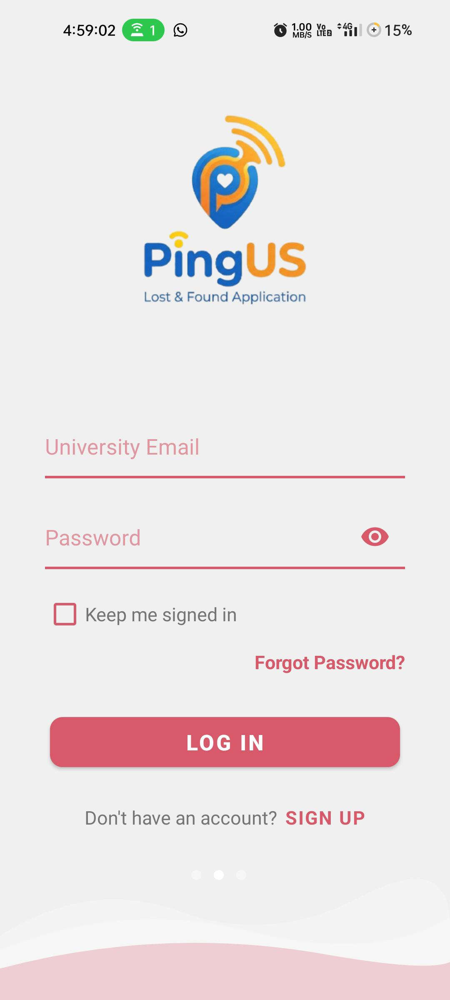
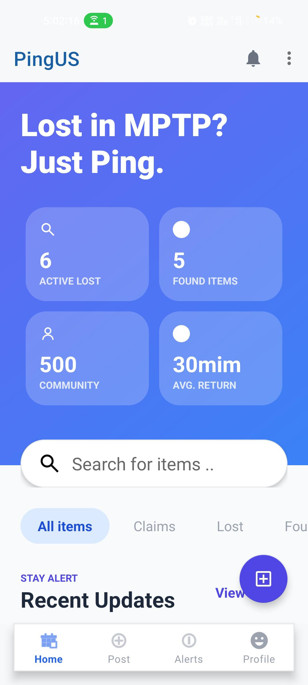
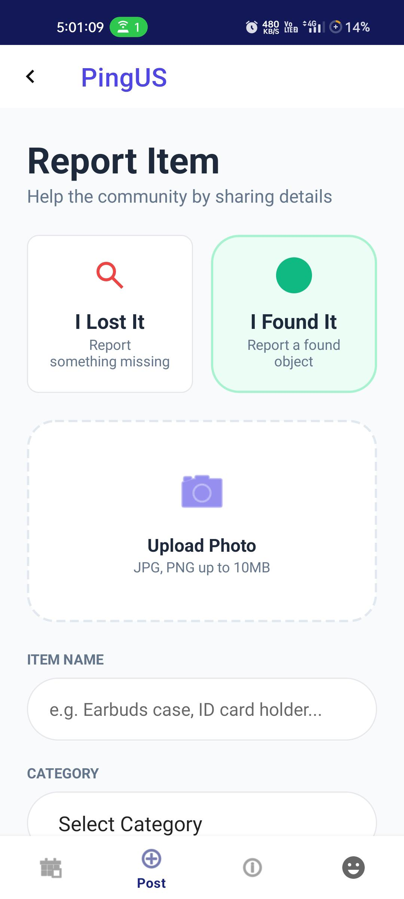

# PingUS: Secure Lost & Found System

**PingUS** is a comprehensive Android application designed to facilitate the reporting and secure recovery of lost and found items. It features a robust **"Blind Handshake"** validation workflow to prevent fraudulent claims and ensure items are safely returned to their rightful owners.

## 📱 Key Features

- **Item Reporting:** Quickly post lost or found items with categorical tags, descriptions, and optional image uploads.
- **"Blind Handshake" Security:** Claimants must accurately answer specific, hidden security questions (e.g., specific color, brand name, distinct markings) established by the poster to prove ownership.
- **Secure Claims Management:** Original posters can securely review claimant answers in an isolated environment and intelligently approve or reject the request.
- **Direct Communication Routing:** Once a claim is approved, the system unlocks direct communication channels (Call, Email, WhatsApp) between the matched users to seamlessly coordinate the return.
- **Real-Time Sync:** Utilizes Firestore real-time listeners for live updates on claim status, notifications, and feed updates.

## 🛠️ Technology Stack

- **Platform:** Android (Java)
- **UI Design:** XML, Material Features, Glide for image loading operations
- **Backend & Auth:** Firebase Authentication
- **Database:** Firebase Cloud Firestore (Real-time NoSQL data sync)
- **Cloud Storage:** Firebase Storage (Optimized item imagery storage)

## 🏛️ High-Level Architecture

The project utilizes an Activity and Fragment-driven architectural pattern, consisting of several core modules:
- **Auth & Onboarding:** Firebase-driven login/signup workflows resulting in a populated Firestore `users` collection.
- **Dynamic Home Feed:** Recycler adapters consuming live `items` data with integrated indexing for searching and filtering.
- **Post Engine:** Multi-stage posting flow capturing item metadata, security questionnaires, and uploading multipart image data.
- **Alerts Engine:** Dashboard powered by snapshot listeners detailing active Processing Queues and structured claim history.

## 🚀 Installation & Setup

1. **Clone the Project:**
   ```bash
   git clone https://github.com/YourUsername/PingUS.git
   ```
2. **Open in IDE:**
   Open the target folder inside **Android Studio**.
3. **Configure Firebase backend:**
   - Create a project on the [Firebase Console](https://console.firebase.google.com/).
   - Add an Android app with the matching package name (`com.example.backtoyou`).
   - Enable **Firebase Authentication**, **Cloud Firestore**, and **Firebase Storage**.
   - Download your generated `google-services.json` file and place it inside the `app/` directory.
4. **Build & Run:**
   Sync Gradle and build the application on your preferred emulator or physical test device.

## 📸 Screenshots

<p align="center">
  
  
  
</p>

## 🔮 Future Roadmap

- [ ] Migration to MVVM Architecture & Repository patterns
- [ ] Integration of Dependency Injection (Hilt/Dagger)
- [ ] Enhanced Firebase Security Rules and Data Validations
- [ ] Automated UI and Unit testing for claim accuracy

---
*Created as part of an academic/enterprise project resolving the challenges of secure asset recovery within restricted spaces.*
